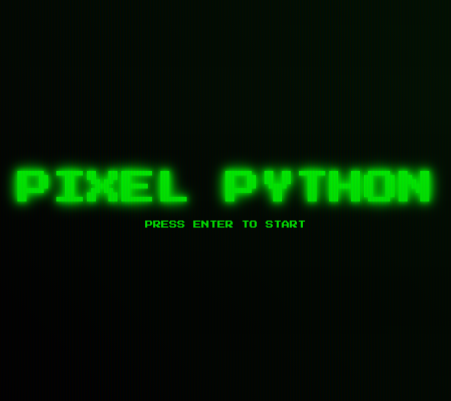

# Pixel Python

Snake con estética de monitor CRT. HTML, CSS y JavaScript sin librerías.

**[Jugar](https://mateoismael.github.io/snake/)** — Enter para empezar, flechas para moverte.

Primer proyecto de 2024. Se juega con teclado; en celular no tiene controles.
